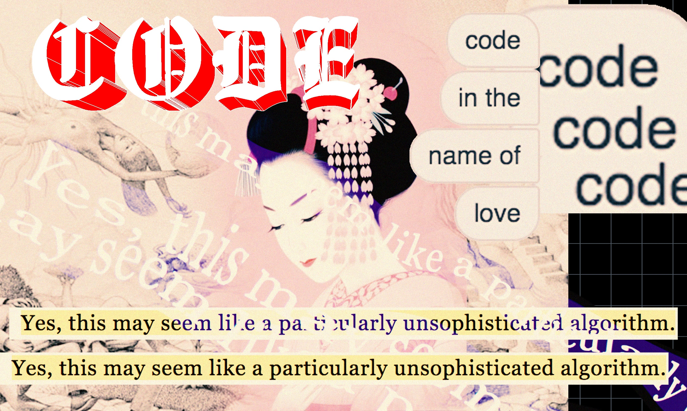

# kochiyama

model of fetishized lust



Illustration taken from [Trauma Doll](https://traumadoll.persona.co/my-traumas) by Sofia Crespo.

# origins

This project was born in the mind of artist [Polly Yim](https://www.pollyyim.com/).
It is a tool needed to achieve her vision. A meditation on how phenotype, reflecting
ethnicity, is contributing to perceived attractiveness and how does it relate to
objectification of human body.

The model of perfect objectifier was needed and therefore this project was born.

# what is it?

It is a bot. But it is designed to transcend own kind. Abstract enough to scrape
the content from any type of dating website, it is not focusing on the question _how_,
but rather _what_. What is happening in the mind of an agent acting out of lust.

# mentalese

Mentalese stands for the language of mind. It is not researched by traditional linguistics,
as it differs significantly from languages used in communication between humans.
It is not researched directly by psychology, as it is already a higher level
conceptualization over what is happening inside our psyche. It is also too far away
from neurons to be treated seriously by neuropsychology.

Traditionally the "language of thoughts" was researched by phenomenology, where the mental
phenomena can be grasped in introspection. This project is built upon very simple
phenomenological model of a mental process.

:any_outcome],[MentalActivity]<-[Analysis;analyze():Intent])

The code which came out of this approach is quite unlike any other code I've ever written:

```java
public class KochiyamaAgent {

  @Inject Memory memory;

  @Inject LetMeInIntent letMeInIntent;

  @Inject ShowMePeopleAsProductsIntent seePeopleAsProductsIntent;

  @Inject UnrollMorePossibilitiesIntent unrollMorePossibilitiesIntent;

  @Inject GoBackIntent goBackIntent;

  @Inject WhichFaceOrdersAndOrdainsMeAnalysis whichFaceOrdersAndOrdainsMeAnalysis;

  @Inject IsThereMorePotentialityAnalysis isThereMorePotentialityAnalysis;

  @Inject DoIWantToUnrollEvenMorePossibilitiesAnalysis doIWantToUnrollEvenMorePossibilitiesAnalysis;

  @Inject
  DoIWantToConceptualizeAnotherPersonaAnalysis doIWantToConceptualizeAnotherPersonaAnalysis;

  @Inject AmIBoredAnalysis amIBoredAnalysis;

  public void start() {
    letMeInIntent.act();
    do {
      exerciseMyOrdoAmoris();
    } while (!amIBoredAnalysis.analyze().act());
  }

  private void exerciseMyOrdoAmoris() {
    seePeopleAsProductsIntent.act();

    do {
      ConceptualizePersonaIntent conceptualizePersonaIntent =
          whichFaceOrdersAndOrdainsMeAnalysis.analyze();
      Person person = conceptualizePersonaIntent.act();
      memory.remember(person);
      goBackIntent.act();

      if (doIWantToUnrollEvenMorePossibilitiesAnalysis.analyze().act()
          && isThereMorePotentialityAnalysis.analyze().act()) {
        unrollMorePossibilitiesIntent.act();
      }

    } while (doIWantToConceptualizeAnotherPersonaAnalysis.analyze().act());

    goBackIntent.act();
  }
}
```

Please read it as code poetry. I am surprised by achieved effect. I experience
the tension between formality of chosen programming language, and the new language of
specific mental process. I feel goose bumps when "cold" Java keywords are read together
with their emotional connotations in natural language. The meditation begins,
eternal one, not being able to decide which structure builds the language and which
one is the metalanguage.

# architecture

Several modules build up this project:


The [exemplum](kochiyama-exemplum) is binding all the modules into something which can be executed.

The [ontology](kochiyama-ontology) describes entities of this mental universe:
[Person](kochiyama-ontology/src/main/java/com/xemantic/kochiyama/ontology/Person.java) and
[Image](kochiyama-ontology/src/main/java/com/xemantic/kochiyama/ontology/Image.java)

The [psyche](kochiyama-psyche) covers basic model
of [elements constituting mental process and memory](kochiyama-psyche/src/main/java/com/xemantic/kochiyama/psyche).

The [memory](kochiyama-memory) is responsible for persisting the content.

The [metacognition](kochiyama-metacognition) is covering mental activities reflecting over other
mental activities. It brings various possibilities of visualizing the mental process.

The [metacognition-console](kochiyama-metacognition-console) is one of possible implementations
of mental process visualizer.

The [lust](kochiyama-lust) is where desires are being modeled.

The [sensorium-orientale](kochiyama-sensorium-orientale) adapts the `lust` to the phenomenon of
websites like [asiandating.com](https://www.asiandating.com). This is code of the fetish,
but in the same time there is nothing of a fetish in the code.

# running

In the [kochiyama-exemplum/src/main/resources](kochiyama-exemplum/src/main/resources) copy
the `kochiyama-template.properties` into `kochiyama.properties` and adjust the properties
accordingly. You will also need either chrome or firefox webdriver or both of them.

Run [KochiyamaBot](kochiyama-exemplum/src/main/java/com/xemantic/kochiyama/exemplum/KochiyamaBot.java)

# who might benefit from such an approach to writing bots?

* whoever wants to scrape content from dating services
* coders of bots which are less automatic and more human-like in their agency, which might
let them pass bot-detection algorithms
* QA specialists, writing test automation with higher level of agency
